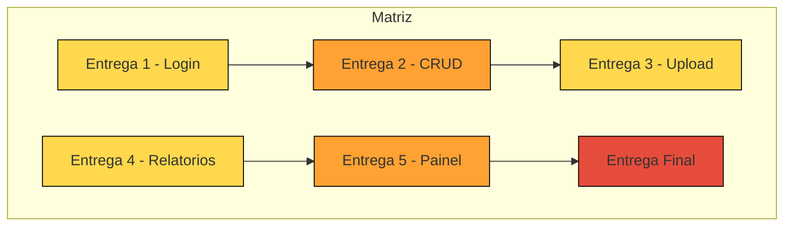
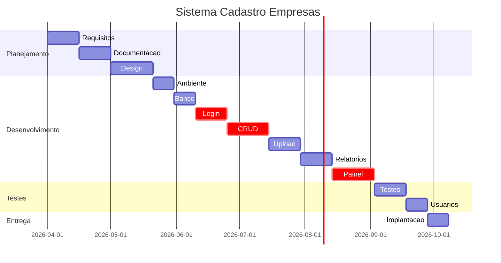

```mermaid
graph TD

subgraph Matriz

A1["Entrega 1 - Login"] --> A2["Entrega 2 - CRUD"] --> A3["Entrega 3 - Upload"]
B1["Entrega 4 - Relatorios"] --> B2["Entrega 5 - Painel"] --> B3["Entrega Final"]

end

classDef laranja fill:#FFA233, stroke:#000;
classDef amarelo fill:#FFD84D, stroke:#000;
classDef vermelho fill:#E64C3C, stroke:#000;

class A1,A3,B1 amarelo
class A2,B2 laranja
class B3 vermelho

```

```mermaid

gantt
    title Sistema Cadastro Empresas
    dateFormat YYYY-MM-DD

    section Planejamento
    Requisitos :a1, 2026-04-01, 15d
    Documentacao :a2, after a1, 15d
    Design :a3, after a2, 20d

    section Desenvolvimento
    Ambiente :b1, after a3, 10d
    Banco :b2, after b1, 10d
    Login :crit, b3, after b2, 15d
    CRUD :crit, b4, after b3, 20d
    Upload :b5, after b4, 15d
    Relatorios :b6, after b5, 15d
    Painel :crit, b7, after b6, 20d

    section Testes
    Testes :c1, after b7, 15d
    Usuarios :c2, after c1, 10d

    section Entrega
    Implantacao :d1, after c2, 10d


```
